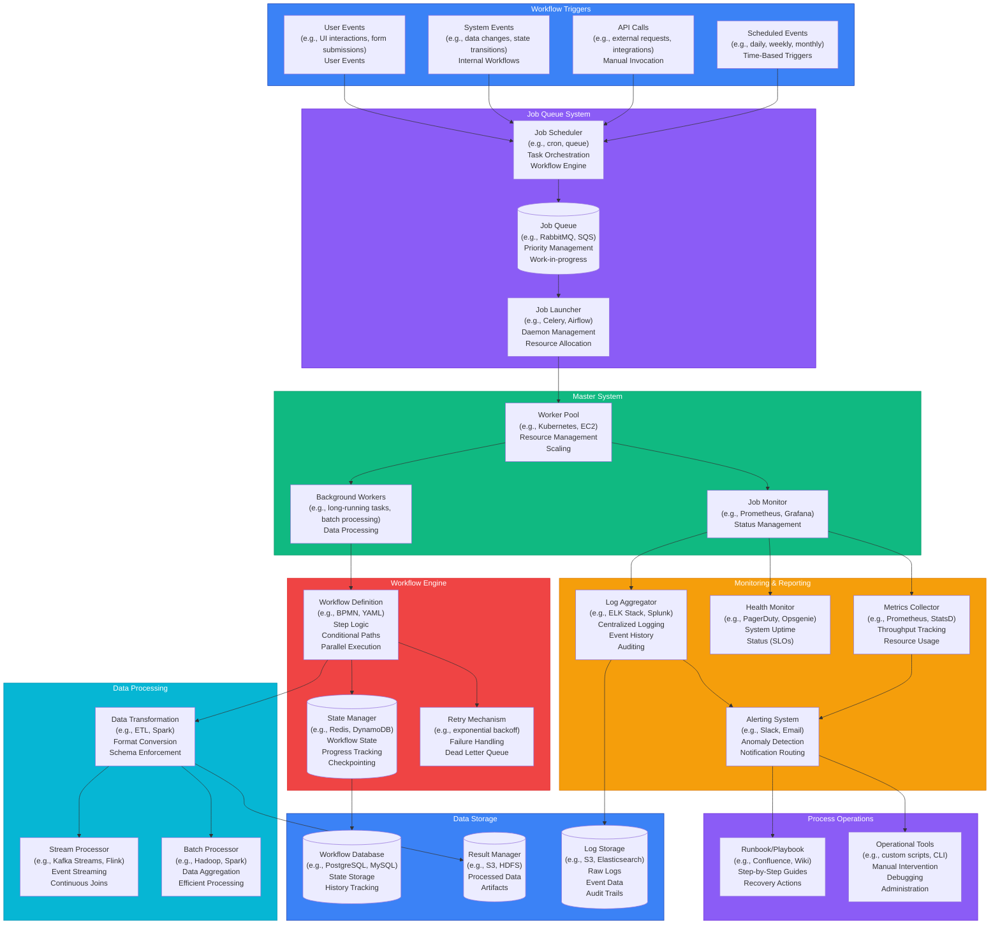
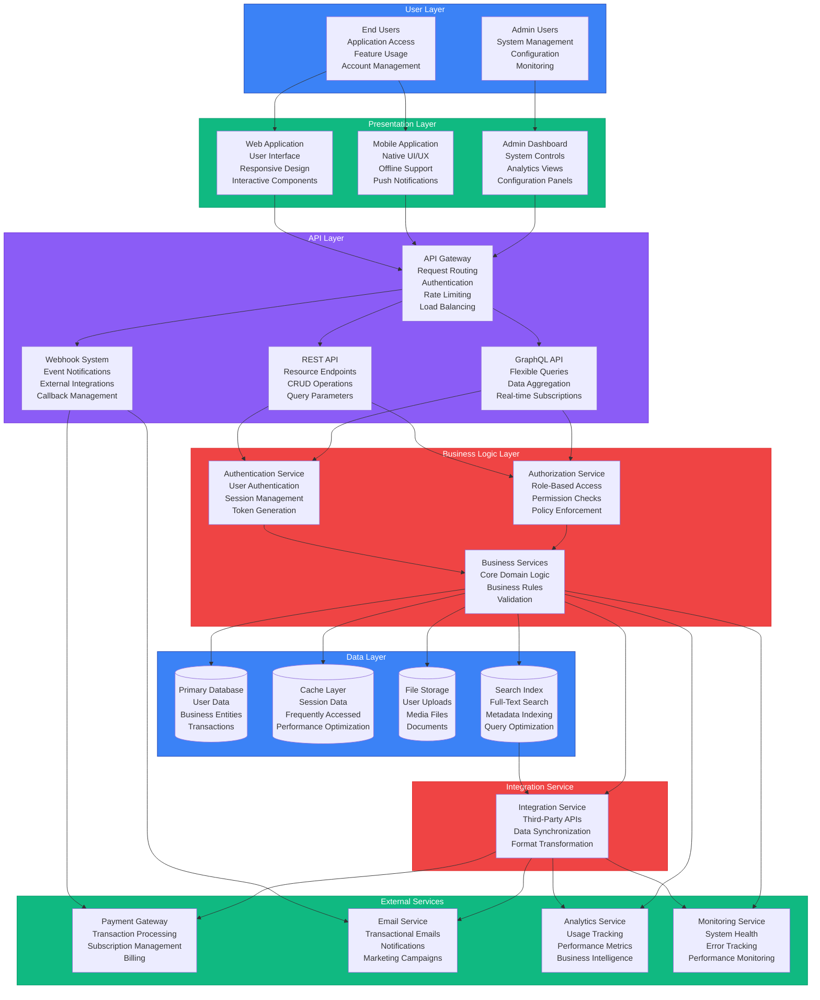

# Flowcharts & Diagrams for Portfolio Project Pages - Lovable Prompt
## Adding Visual Flowcharts to Project Detail Pages

### CONTEXT & OBJECTIVE
Add detailed flowcharts and architectural diagrams to the portfolio project detail pages. These visual diagrams are essential for showcasing the complexity and thoughtfulness of the systems design work. Each project that involves process architecture, workflow design, or system architecture should include relevant flowcharts.

---

## PROJECT DETAIL PAGE STRUCTURE WITH FLOWCHARTS

### Page Layout (Updated)
1. Navigation
2. Project Title
3. Project Description
4. **FLOWCHART/DIAGRAM SECTION** ← NEW
5. Related Project Links
6. Footer

---

## FLOWCHART IMPLEMENTATION OPTIONS

### Option 1: Mermaid.js (Recommended)
- **Library**: Mermaid.js (https://mermaid.js.org/)
- **CDN**: `<script src="https://cdn.jsdelivr.net/npm/mermaid/dist/mermaid.min.js"></script>`
- **Pros**: Easy to implement, responsive, customizable
- **Cons**: Requires JavaScript

### Option 2: SVG Diagrams
- **Format**: Inline SVG or external SVG files
- **Pros**: Scalable, no dependencies
- **Cons**: More complex to create/maintain

### Option 3: Image Files
- **Format**: PNG, SVG, or WebP
- **Pros**: Simple, works everywhere
- **Cons**: Not interactive, harder to update

### Option 4: React Flow / React Diagrams
- **Library**: React Flow, React Diagrams, or similar
- **Pros**: Interactive, professional
- **Cons**: Requires React framework

**RECOMMENDATION**: Use Mermaid.js for easy implementation and professional results.

---

## PROJECT 1: SaaS WORKFLOW DESIGN

### Route
`/projects/projects-detail/saas-workflow-design`

### Flowchart Title
"SaaS Business Process Architecture"

### Flowchart Description
This diagram shows the complete workflow system architecture, from triggers through execution to monitoring.

### Mermaid Diagram Code



### Visual Styling
- **Colors**: Use distinct colors for each section (blue, purple, green, red, teal, orange)
- **Layout**: Top-to-bottom flow
- **Size**: Full width, responsive
- **Background**: Dark theme compatible (light text on dark or vice versa)

### Implementation Notes
- Place flowchart after project description
- Add section heading: "System Architecture" or "Workflow Diagram"
- Ensure diagram is scrollable on mobile
- Add zoom/pan functionality if needed for large diagrams

---

## PROJECT 2: SaaS BUSINESS PROCESS ARCHITECTURE

### Route
`/projects/projects-detail/saas-business-process-architecture`

### Flowchart Title
"SaaS Application Architecture"

### Flowchart Description
This diagram shows the complete application architecture from user layer through to external services.

### Mermaid Diagram Code



### Visual Styling
- **Colors**: Distinct colors for each layer
- **Layout**: Vertical layers (top to bottom)
- **Size**: Full width, responsive
- **Background**: Dark theme compatible

---

## IMPLEMENTATION GUIDE

### Step 1: Add Mermaid.js to Project

**For HTML/Static Site**:
```html
<script src="https://cdn.jsdelivr.net/npm/mermaid/dist/mermaid.min.js"></script>
<script>
  mermaid.initialize({ 
    startOnLoad: true,
    theme: 'dark',
    themeVariables: {
      primaryColor: '#3b82f6',
      primaryTextColor: '#fff',
      primaryBorderColor: '#1e40af',
      lineColor: '#94a3b8',
      secondaryColor: '#8b5cf6',
      tertiaryColor: '#10b981'
    }
  });
</script>
```

**For React/Next.js**:
```bash
npm install mermaid
```

```jsx
import { useEffect } from 'react';
import mermaid from 'mermaid';

export default function Flowchart({ diagram }) {
  useEffect(() => {
    mermaid.initialize({ 
      startOnLoad: true,
      theme: 'dark',
      themeVariables: {
        primaryColor: '#3b82f6',
        primaryTextColor: '#fff',
        primaryBorderColor: '#1e40af',
        lineColor: '#94a3b8',
        secondaryColor: '#8b5cf6',
        tertiaryColor: '#10b981'
      }
    });
    mermaid.contentLoaded();
  }, []);

  return (
    <div className="mermaid">
      {diagram}
    </div>
  );
}
```

### Step 2: Create Flowchart Component

**Component Structure**:
```jsx
// FlowchartSection.jsx
export default function FlowchartSection({ title, description, diagramCode }) {
  return (
    <section className="flowchart-section py-12">
      <div className="max-w-7xl mx-auto px-6">
        {title && <h3 className="text-2xl font-bold mb-4">{title}</h3>}
        {description && <p className="text-gray-400 mb-8">{description}</p>}
        <div className="flowchart-container bg-gray-900 rounded-lg p-6 overflow-x-auto">
          <div className="mermaid">
            {diagramCode}
          </div>
        </div>
      </div>
    </section>
  );
}
```

### Step 3: Add to Project Detail Pages

**Updated Page Structure**:
```jsx
// ProjectDetailPage.jsx
export default function ProjectDetailPage({ project }) {
  return (
    <>
      <Navigation />
      <main>
        <ProjectHeader title={project.title} />
        <ProjectDescription text={project.description} />
        
        {/* NEW: Flowchart Section */}
        {project.flowchart && (
          <FlowchartSection
            title={project.flowchart.title}
            description={project.flowchart.description}
            diagramCode={project.flowchart.code}
          />
        )}
        
        <RelatedProjects links={project.relatedLinks} />
      </main>
      <Footer />
    </>
  );
}
```

---

## STYLING SPECIFICATIONS

### Flowchart Container
- **Background**: Dark gray (`bg-gray-900` or `#111827`)
- **Padding**: `p-6` or `p-8` (24-32px)
- **Border Radius**: `rounded-lg` (8px)
- **Overflow**: `overflow-x-auto` (horizontal scroll on mobile)
- **Margin**: `my-8` or `my-12` (vertical spacing)

### Flowchart Title
- **Font**: Bold, large (text-2xl or text-3xl)
- **Color**: White
- **Margin**: `mb-4` (16px below)

### Flowchart Description
- **Font**: Regular, medium (text-base or text-lg)
- **Color**: Light gray (`text-gray-400`)
- **Margin**: `mb-8` (32px below)

### Mermaid Theme Configuration
```javascript
{
  theme: 'dark',
  themeVariables: {
    // Background colors
    darkMode: true,
    background: '#111827',
    primaryColor: '#3b82f6',      // Blue
    primaryTextColor: '#ffffff',
    primaryBorderColor: '#1e40af',
    secondaryColor: '#8b5cf6',     // Purple
    tertiaryColor: '#10b981',      // Green
    // Text colors
    textColor: '#ffffff',
    lineColor: '#94a3b8',
    // Node colors
    nodeBkg: '#1f2937',
    nodeBorder: '#3b82f6',
    // Edge colors
    edgeLabelBackground: '#1f2937',
    clusterBkg: '#1f2937',
    clusterBorder: '#3b82f6'
  }
}
```

---

## RESPONSIVE BEHAVIOR

### Mobile (< 768px)
- **Container**: Full width with horizontal scroll
- **Padding**: Reduced (`p-4`)
- **Font Size**: Smaller text in nodes
- **Zoom**: Allow pinch-to-zoom for detailed diagrams

### Tablet (768px - 1024px)
- **Container**: Full width, no scroll if possible
- **Padding**: Medium (`p-6`)
- **Font Size**: Medium text in nodes

### Desktop (> 1024px)
- **Container**: Full width, optimal viewing
- **Padding**: Full (`p-8`)
- **Font Size**: Full size text
- **Interactive**: Optional zoom/pan controls

---

## ADDITIONAL PROJECTS WITH FLOWCHARTS

### Projects That May Need Flowcharts

1. **Retail & Wholesale Digitization**
   - Order processing workflow
   - Inventory management flow
   - Payment processing architecture

2. **Coaching/Community Platform Systems**
   - User onboarding flow
   - Event-driven automation architecture
   - Membership management system

3. **Mac Assistant — Local AI Automation**
   - AI agent workflow
   - Local processing architecture
   - Data flow diagram

4. **Fitness Operations Automation**
   - Class scheduling workflow
   - Member management flow
   - Payment and booking system

### Flowchart Types by Project

**Process Flowcharts**: Show step-by-step processes
- Use: `flowchart TD` (top-down) or `flowchart LR` (left-right)
- Best for: Workflows, user journeys, business processes

**System Architecture Diagrams**: Show system components
- Use: `graph TB` (top-bottom) with subgraphs
- Best for: Technical architecture, system design

**Sequence Diagrams**: Show interactions over time
- Use: `sequenceDiagram`
- Best for: API interactions, user flows

**State Diagrams**: Show state transitions
- Use: `stateDiagram-v2`
- Best for: System states, workflow states

---

## IMPLEMENTATION CHECKLIST

### Setup
- [ ] Add Mermaid.js library (CDN or npm)
- [ ] Initialize Mermaid with dark theme
- [ ] Create FlowchartSection component
- [ ] Add responsive styling

### Content
- [ ] Add flowchart to SaaS Workflow Design page
- [ ] Add flowchart to SaaS Business Process Architecture page
- [ ] Identify other projects needing flowcharts
- [ ] Create diagram code for each flowchart

### Styling
- [ ] Configure dark theme for Mermaid
- [ ] Style flowchart container
- [ ] Add responsive breakpoints
- [ ] Test on mobile devices

### Testing
- [ ] Verify diagrams render correctly
- [ ] Test responsive behavior
- [ ] Check dark theme compatibility
- [ ] Verify accessibility (alt text, descriptions)

---

## EXAMPLE: COMPLETE PROJECT DETAIL PAGE WITH FLOWCHART

```jsx
// SaaSWorkflowDesign.jsx
import FlowchartSection from '@/components/FlowchartSection';

const flowchartCode = `
graph TB
    subgraph Triggers["Workflow Triggers"]
        T1["Scheduled Events"]
        T2["API Calls"]
        T3["System Events"]
        T4["User Events"]
    end
    // ... rest of diagram
`;

export default function SaaSWorkflowDesign() {
  return (
    <>
      <Navigation />
      <main className="min-h-screen bg-black text-white">
        <div className="max-w-7xl mx-auto px-6 py-12">
          {/* Project Title */}
          <h1 className="text-4xl md:text-5xl font-bold mb-6">
            SaaS Workflow Design
          </h1>
          
          {/* Project Description */}
          <div className="prose prose-invert max-w-none mb-12">
            <p className="text-lg leading-relaxed">
              Detailed, execution‑ready workflows for critical SaaS processes 
              with automation where it adds the most leverage...
            </p>
          </div>
          
          {/* Flowchart Section */}
          <FlowchartSection
            title="SaaS Business Process Architecture"
            description="Complete workflow system architecture from triggers through execution to monitoring"
            diagramCode={flowchartCode}
          />
          
          {/* Related Projects */}
          <div className="mt-12">
            <a href="/projects/saas-business-process-architecture" 
               className="text-blue-400 hover:text-blue-300">
              SaaS Business Process Architecture ›
            </a>
          </div>
        </div>
      </main>
      <Footer />
    </>
  );
}
```

---

## TROUBLESHOOTING

### Diagram Not Rendering
- Check Mermaid.js is loaded
- Verify diagram syntax is correct
- Check browser console for errors
- Ensure `mermaid.initialize()` is called

### Styling Issues
- Verify dark theme is applied
- Check color contrast for readability
- Ensure responsive container works
- Test on multiple screen sizes

### Performance
- Lazy load diagrams below the fold
- Use `mermaid.contentLoaded()` after component mount
- Consider code splitting for large diagrams

---

## FINAL NOTES

### Design Philosophy
- **Visual Clarity**: Diagrams should be easy to read and understand
- **Dark Theme**: Match site's dark aesthetic
- **Responsive**: Work on all screen sizes
- **Professional**: Clean, well-organized diagrams

### Content Strategy
- Each flowchart should tell a story
- Use clear labels and descriptions
- Group related components
- Show flow and relationships clearly

### Maintenance
- Keep diagram code in version control
- Document diagram structure
- Update diagrams as systems evolve
- Test after updates

---

**END OF PROMPT**

This prompt provides everything needed to add flowcharts to portfolio project pages using Mermaid.js. The diagrams will enhance the project detail pages by visually showing the complexity and thoughtfulness of the systems design work.


